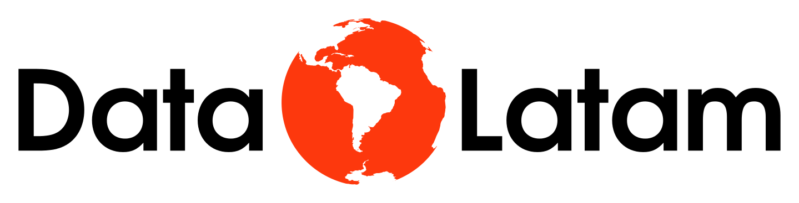

<!-- README.md is generated from README.Rmd. Please edit that file -->

```{r, include = FALSE}
knitr::opts_chunk$set(
  collapse = TRUE,
  comment = "#>",
  fig.path = "man/figures/README-",
  out.width = "80%"
)
options(tibble.print_min = 5, tibble.print_max = 5)
```

# Webinario Desplegando mis productos de datos de R con Google Cloud Run  <a href='http://www.datalatam.com/'></a>

<!-- badges: start -->
<!-- badges: end -->

Este es el repositorio que contiene el material utilizado durante el webinario 
de [Data Latam](www.datalatam.com) que puede ser utilizado como referencia
para seguir los pasos mostrados.

## Sinopsis del webinario

¿Han terminado su trabajo con R en una presentación, blog, página estática o
aplicación en R, pero no encuentran una forma de publicarlo en la web? Si
tenemos la necesidad de compartir nuestros productos de datos con otras
personas de una manera sencilla a través de un enlace web, el uso de google
cloud run puede solucionarnos el desplegar nuestras aplicaciones.

En este webinario estaremos explicando los procesos de despliegue continuo a
través de google cloud run para productos de datos construidos con R y, todo lo
necesario para establecer nuestro flujo de trabajo,los elementos y herramientas
que necesitamos para llegar a publicar nuestra aplicación. Revisaremos el uso
de herramientas como git, docker, google cloud build y google cloud run. 

La ventaja de realizar el esfuerzo por integrar este flujo de trabajo a nuestra
manera de publicar aplicaciones es que podemos realizar cambios con relativa
facilidad y frecuencia, con la ventaja de que si es un cambio que causa un
error, este se mantendrá aislado de nuestra app en producción.

Este webinario está basado en en blog post de ixpantia Google cloud run para
desplegar productos de R, así que si eres nuevo en este tema y quieres tener
una idea previa de los pasos que vamos a seguir, puedes revisarlo.

## Otros materiales

Tenemos referencias que pueden ser de ayuda para comprender mejor el proceso
de despliegue continuo de productos de datos de R con el servicio de Google 
Cloud Run.

 - Blogpost **Google cloud run para desplegar productos de R**: Los pasos para 
 desplegar con Google Cloud Run y Google Cloud Build una presentación construida
 con el paquete xaringan y desde un sourced repository de google están descritos
 en el blog de [ixpantia](https://www.ixpantia.com/es/) titulado [Google cloud run para desplegar productos de R](https://connect.ixpantia.com/ixblog/posts/2020-12-01-google-cloud-run-para-desplegar-productos-de-r/)

 - Webinario **Usando módulos en Shiny: Guía de inicio rápido**: Es un webinario
 impartido en octubre del 2019 cuya grabación está disponible en el 
 [canal de youtube de Data Latam](https://www.youtube.com/watch?v=Hq0bcy4DCDg)

## Organiza

Este evento lo organiza [Data Latam](http://wwww.datalatam.com) en cooperación 
con [ixpantia](https://www.ixpantia.com). Data Latam es una comunidad 
Latinoamericana de profesionales y académicos aplicando ciencia de datos en su 
día a día en la industria de datos en Latino América. En los eventos, cursos y 
programas de extensión exploramos tecnologías, aprendemos sobre ciencia de 
datos, hablamos de tendencias y eventos relevantes de la industria, y 
compartimos novedades del sector.

#### Participar en la comunidad de Data Latam

Si quieres tener una participación activa en la comunidad de Data Latam podés
escribirnos a `hola@ixpantia.com` para proponer temas o personas para siguientes
webinarios. ¡Cualquier idea es bienvenida!


